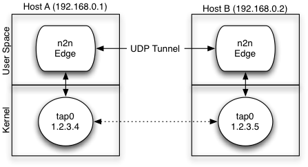
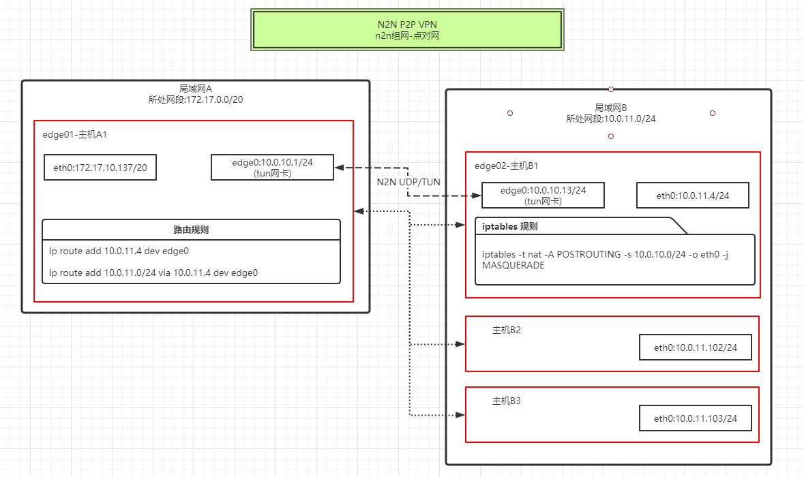
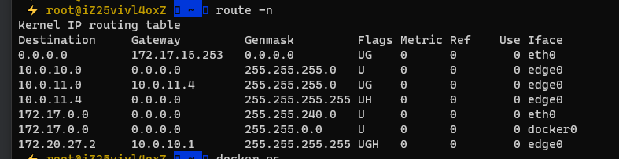
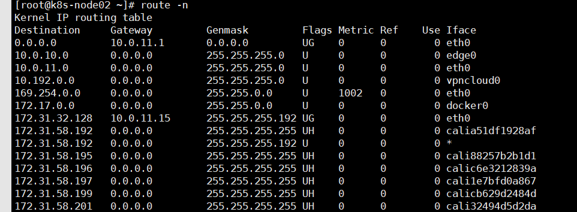

# docker n2n

## 关于

[n2n][n2n] 是一个[ntop 团队][ntop] 推出的 **第二层对等 VPN**，可轻松创建绕过中间防火墙的虚拟网络。

N2N 是通过UDP方式建立链接，如果某个网络禁用了 UDP，那么该网络下的设备就不适合使用本软件来加入这个虚拟局域网

N2N节点分为下面两种角色：

1. *supernode* ：
它允许edge节点链接和发现其他edge的超级节点。
它必须具有可在公网上公开访问的端口。

2. *edge* ：将成为虚拟网络一部分的节点;
在n2n中的多个边缘节点之间共享的虚拟网络称为community。

单个supernode节点可以中继多个edge，而单个电脑可以同时连接多个supernode。
边缘节点可以使用加密密钥对社区中的数据包进行加密。
n2n尽可能在edge节点之间建立直接的P2P连接;如果不可能（通常是由于特殊的NAT设备），则超级节点将用于中继数据包。

### 组网示意



### 连接原理


## 快速上手

### 代码换行

|终端|符号|按键方法|
---:|:---:|:---|
|bash| \\ | 回车键上方 |
|powershell|**`**|键盘TAB按钮上方|
|CMD|**＾**|键盘SHIFT+6|

### 自定义容器启动命令

```bash
docker run --rm -ti -p 10086:10086 registry.cn-hangzhou.aliyuncs.com/sourcegarden/n2n supernode -l 10086 -v
```

### 创建 *supernode* 

```bash
docker run \
  -d --restart=always \
  --name=supernode \
  -e MODE="SUPERNODE" \
  -e SUPERNODE_PORT=10086 \
  -p 10086:10086/udp \
  -e N2N_ARGS="-v" \
  registry.cn-hangzhou.aliyuncs.com/sourcegarden/n2n
```

### 创建 *edge*

```bash
docker run \
  -d --restart=always \
  --name n2n_edge \
  --privileged \
  --net=host \
  -e MODE="STATIC" \
  -e STATIC_IP="10.0.10.10" \
  -e N2N_GROUP="zctmdc_proxy" \
  -e N2N_PASS="zctmdc_proxy" \
  -e N2N_SERVER="n2n.lucktu.com:10086" \
  -e N2N_ARGS="-A -v" \
  registry.cn-hangzhou.aliyuncs.com/sourcegarden/n2n
```


## 环境变量介绍

|变量名|变量说明|备注|对应参数|默认值|
|---:|:---|:---|:---|----|
|MODE|模式|对应启动的模式| *`SUPERNODE`* *`DHCP`* *`STATIC`* *`DHCPD`* |DHCPD|
|SUPERNODE_PORT|超级节点端口|在SUPERNODE中使用|-l|10086|
|N2N_SERVER|要连接的N2N超级节点|IP:port|-l|www.funny.com:10086|
|STATIC_IP|静态IP|在静态模式和DHCPD使用|-a|10.0.10.10|
|N2N_GROUP|组网名称|在EDGE中使用|-c|funny_proxy|
|N2N_PASS|组网密码|在EDGE中使用|-k|funny_proxy|
|N2N_INTERFACE|网卡名|edge生成的网卡名字|-d|edge0|
|N2N_ARGS|更多参数|运行时附加的更多参数|-Av|-Av|


### MODE模式说明

SUPERNODE：  超级节点

DHCPD: 开启DHCPD服务的edge节点，开启后若没有dhcp配置文件，启动脚本将自动生成（容器中的路径为/etc/dhcp/dhcpd.conf)

DHCP: 开启DHCP客户端的edge节点

STATIC: 指定IP的edge节点


## 若要测试，可以使用 *docker-compose* 快速运行

```bash
# docker-compose up -d
docker-compose run n2n_edge_dhcp
```


## 命令行参数说明

### supernode

```
bash-5.0# supernode -h
Welcome to n2n v. for Linux-4.19.104-microsoft-standard
Built on Aug 14 2020 07:20:17
Copyright 2007-2020 - ntop.org and contributors

supernode <config file> (see supernode.conf)
or
supernode -l <local port> -c <path> [-u <uid> -g <gid>] [-t <mgmt port>] [-d <net/bit>] [-v] 

-l <port>     | Set UDP main listen port to <port>
-c <path>     | File containing the allowed communities.
-u <UID>      | User ID (numeric) to use when privileges are dropped.
-g <GID>      | Group ID (numeric) to use when privileges are dropped.
-t <port>     | Management UDP Port (for multiple supernodes on a machine).
-d <net/bit>  | Subnet that provides dhcp service for edge. eg. -d 172.17.12.0/24
-v            | Increase verbosity. Can be used multiple times.
-h            | This help message.
```


### edge

```
bash-5.0# edge -h
Welcome to n2n v. for Linux-4.19.104-microsoft-standard
Built on Aug 14 2020 07:20:17
Copyright 2007-2020 - ntop.org and contributors

edge <config file> (see edge.conf)
or
edge -d <tun device> -a [static:|dhcp:]<tun IP address> -c <community> [-k <encrypt key>]
    [-s <netmask>] [-u <uid> -g <gid>][-f][-T <tos>][-n cidr:gateway] [-m <MAC address>] -l <supernode host:port>
    [-p <local port>] [-M <mtu>] [-D] [-r] [-E] [-v] [-i <reg_interval>] [-L <reg_ttl>] [-t <mgmt port>] [-A[<cipher>]] [-H] [-z[<compression algo>]] [-h]

-d <tun device>          | tun device name
-a <mode:address>        | Set interface address. For DHCP use '-r -a dhcp:0.0.0.0'
-c <community>           | n2n community name the edge belongs to.
-k <encrypt key>         | Encryption key (ASCII) - also N2N_KEY=<encrypt key>.
-s <netmask>             | Edge interface netmask in dotted decimal notation (255.255.255.0).
-l <supernode host:port> | Supernode IP:port
-i <reg_interval>        | Registration interval, for NAT hole punching (default 20 seconds)
-L <reg_ttl>             | TTL for registration packet when UDP NAT hole punching through supernode (default 0 for not set )
-p <local port>          | Fixed local UDP port.
-u <UID>                 | User ID (numeric) to use when privileges are dropped.
-g <GID>                 | Group ID (numeric) to use when privileges are dropped.
-f                       | Do not fork and run as a daemon; rather run in foreground.
-m <MAC address>         | Fix MAC address for the TAP interface (otherwise it may be random)
                         | eg. -m 01:02:03:04:05:06
-M <mtu>                 | Specify n2n MTU of edge interface (default 1290).
-D                       | Enable PMTU discovery. PMTU discovery can reduce fragmentation but
                         | causes connections stall when not properly supported.
-r                       | Enable packet forwarding through n2n community.
-A1                      | Disable payload encryption. Do not use with key (defaulting to Twofish then).
-A2 ... -A5 or -A        | Choose a cipher for payload encryption, requires a key: -A2 = Twofish (default),
                         | -A3 or -A (deprecated) = AES-CBC, -A5 = Speck-CTR.
-H                       | Enable full header encryption. Requires supernode with fixed community.
-z1 ... -z2 or -z        | Enable compression for outgoing data packets: -z1 or -z = lzo1x (default=disabled).
-E                       | Accept multicast MAC addresses (default=drop).
-S                       | Do not connect P2P. Always use the supernode.
-T <tos>                 | TOS for packets (e.g. 0x48 for SSH like priority)
-n <cidr:gateway>        | Route an IPv4 network via the gw. Use 0.0.0.0/0 for the default gw. Can be set multiple times.
-v                       | Make more verbose. Repeat as required.
-t <port>                | Management UDP Port (for multiple edges on a machine).

Environment variables:
  N2N_KEY                | Encryption key (ASCII). Not with -k.


#若直接通过命令行启动,可以参考下列命令:
./edge -d edge -a dhcp 0.0.0.0 \
       -c fucking_proxy \
       -k fucking_proxy \
       -l 123.2.1.2:10086 \
       -r -A -v 
```


## 组网

### 点对网

  所谓"点对网",就是指edge节点可以和某个edge节点所处的局域网内的所有主机通信

  具体实现方式,可以参考下图所示:




主机A1相关路由信息:



主机B1相关路由信息:




参考:
"ntop团队": https://github.com/ntop 
"客户端下载": https://github.com/lucktu/n2n 
"组网示意": https://web.archive.org/web/20110924083045im_/http://www.ntop.org/wp-content/uploads/2011/08/n2n_network.png 
"连接原理": https://web.archive.org/web/20110924083045im_/http://www.ntop.org/wp-content/uploads/2011/08/n2n_com.png 
"N2N 新手向导及最新信息（2019-12-05 更新）": http://www.lucktu.com/archives/783.html 
"N2N免费中心节点": http://supernode.ml/ 
"github地址": https://github.com/zctmdc/docker/n2n-ntop 